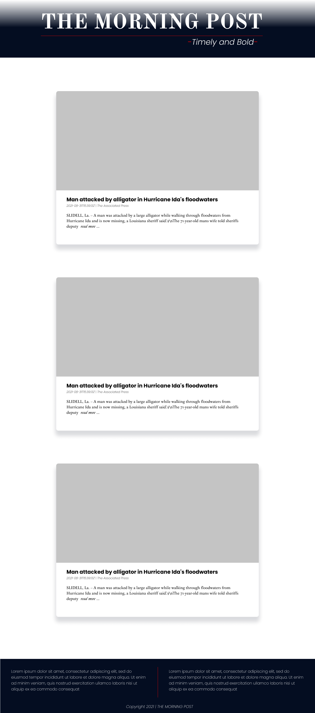

# The Morning Post

#### The Morning Post is a one stop news platform, September 2021

#### By **Kelvin Gitahi**

## Description

The Morning Post consolidates major trusted news sources into one platform for easy timely headlines and latest stories. See screenshots below:

## Setup/Installation Requirements

- You need a good perfoming computer/laptop: Core i3 or equivalent with high resolution display
- Clone from Github
- Open terminal on the cloned folder
- Run ./start.sh
- Easy Peasy😉
- Alternatively, go [here](https://the-morning-post.herokuapp.com/)

## Known Bugs

There are no known bugs currently but I look forward to improving the overall user experience

## Technologies Used

This site was made entirely using:

- HTML
- CSS
- Python|Flask
- Bootstrap

## Support and contact details

I'd love to chat! Ping me on [Twitter](https://twitter.com/kevocb) should any issues arise, or just say Hi!

### License

_MIT Licence_
Copyright &copy; 2021 **Kelvin Gitahi**
